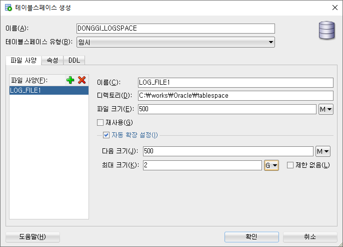

= Oracle Study
:doctype: book
:icons: font
:source-highlighter: highlightjs
:toc: left
:toclevels: 3
:sectlinks:

- - -

REFR::
link:https://www.youtube.com/watch?v=aDTiSKcMtoc&list=PLq8wAnVUcTFVq7RD1kuUwkdWabxvDGzfu&index=2[newlecture]

Access Program::
. SQL Plus :
.. ID : sys as sysdba
.. PW : [PW]

. SQL Developer

== Getting Started

[upperroman]
. Search list of PDB after sqlplush accessing after running the terminal

+

[source,bash]
----
sqlplus sys as sysdba
----

+

[source,sql]
----
select name from v$pdbs;
----

+
.PDBS 목록 조회

. Start SQL Developer

+

.pdb 접속

pdb 계정은 cdb 계정과 다른계정이다.

. Allow remote access

+

[source, sql]

----
EXEC DBMS_XDB.SETLISTENERLOCALACCESS(FALSE);
----
.관리자 저장 프로시저

. Setting DBA of PDB schema

.. "접속"탭 PDB -> 보기 -> DBA

+

image::src/img/getting_started_4_1.png[1]

.. PDB 선택

+

image::src/img/getting_started_4_2.png[2]

.. "DBA"탭 -> 저장 영역 -> 테이블스페이스 -> 새로만들기

+

.. 저장용 Table 생성

+

.유형 영구, 파일크기 500MB, 최대크기 2GB

.. 임시 로그 Table 생성

+

.유형 임시, 파일크기 500MB, 최대크기 2GB

. Create user for tablespace

.. "DBA"탭 -> 보안 영역 -> 사용자 -> 새로만들기

+

image::src/img/getting_started_5_1.png[사용자만들기]

.. Set User info

+

+

TIP: 사용자명 대문자로 지정, 소문자로 할경우 `" "` 로 지정해줘야하는 번거로움이 생김

.. Set User Permissions

+

+

.일반사용자 권한을 벗어난 목록들 체크해제
* [ ] SYSKM
* [ ] SYSOPER
* [ ] SYSRAC 

.. Connect as created user

+

== Concept

=== Pluggable
[#CDB-PDB]
.CDB & PDB
image::src/img/pdb.png[CDB]

CDB:: Container DB +
물리적인 DB이다.

PDB:: Pluggable DB +
CDB안에 Seed로 만들어지는 가상 DB이다.

PDB$SEED:: PDB의 원본 +
인터페이스같은 역할

XEPDB1:: SEED로 생성한 실제 PDB의 이름 (현재이름, 가변적), 

+

[source,sql]
.PDB 목록 확인하는 쿼리문
----
SELECT name FROM v$pdbs;
----

DUAL Table::
값을 뽑아내야하지만 구문상 Table을 조회해야할경우 사용할수있는 임시 테이블, 더미테이블이다.

== Query

=== DDL
    Data Definition Language
    데이터 정의어

==== CREATE
Ex)::
[source,sql]
----
CREATE TABLE MEMBER (
    ID          VARCHAR2(50),
    PWD         NVARCHAR2(50),
    NAME        NVARCHAR2(50),
    GENDER      NCHAR(2), -- 남성, 여성
    AGE         NUMBER(3),
    BIRTHDAY    CHAR(10), -- 2000-01-02
    PHONE       CHAR(13), -- 010-1243-4567
    REGDATE     DATE
);
----

==== ALTER
. 수정

+ 
[source,sql]
.ID를 VARCHAR -> NVARCHAR로 수정
----
ALTER TABLE MEMBER MODIFY ID NVARCHAR2(50);
----

. 삭제

+

[source,sql]
.AGE 컬럼을 삭제
----
ALTER TABLE MEMBER DROP COLUMN AGE;
----

. 추가

+

[source,sql]
.EMAIL 컬럼 추가
----
ALTER TABLE MEMBER ADD EMAIL VARCHAR2(200);
----

==== DROP

=== DML
    Data Manipulation Language
    데이터 조작어

==== INSERT

명령 규칙::

+

[source,sql]
.기본
----
INSERT INTO <테이블> VALUES <값 목록>
----

+

[source,sql]
.원하는 필드만 입력
----
INSERT INTO(col1,col2) VALUES(val1, val2);
----

IMPORTANT: VALUES 안에 데이터를 넣을때 `""`(쌍 따옴표) 가 아닌 `''` (따옴표) 를 넣어야한다.

==== SELECT

==== UPDATE
명령 규칙::

+

[source,sql]
.모든행 수정
----
UPDATE <테이블> SET col=new_val;
----

+

[source,sql]
.특정행 수정
----
UPDATE <테이블> SET col=new_val [, ...] WHERE col=origin_val;
----

==== DELETE
명령 규칙::

+

[source,sql]
.특정행 삭제
----
DELETE <테이블> WHERE col=val;
----

=== DCL
    Data Control Language
    데이터를 사용할수 있는 권한

==== GRANT
==== REVOKE

=== TCL
    Transaction Control Language
    트랜젝션; 업무 실행단위, 논리적인 실행 (작업 수행) 단위

Oracle은 모든수행이 기본적으로 임시저장소로 가게된다. +
그래서 한 Session에서 `INSERT`, `DELETE`, `UPDATE` 등 수행해도 다른 Session에서 `SELECT` 을 해도 변경된값이 조회가 안되는게 그이유에서 이다. +

그래서 마지막에 `COMMIT` 을 해야지 물리적인 저장소로 이동을하게된다.

LOCK::
현재 `COMMIT` , `ROLLBACK` 을 하기전 다른 Session 에서 사용중이라면 `LOCK` 이걸려서 데이터를 조작할수없다.

==== COMMIT

==== ROLLBACK

==== SAVEPOINT

=== FILTER

==== ROWNUM
결과를 만들고나서 Auto Increment 처럼 1부터 자동으로 증가된 값이 생성되는 컬럼이다. +
필드의 값이 처음부터 실존하는 값이 아닌 결과로부터 만들어지는 가변적인 값이다.

Ex)::

+

[source, sql]
.잘못된예시
----
SELECT * FROM MEMEBER WHERE ROWNUM BETWEEN 5 AND 10;
----

+

`ROWNUM` 은 결과값에서 1부터 증가하여 생성되는 컬럼인데 5의 이상의 값을 조건으로 넣었기때문에 결과 값이 생성되지않는다.

+

[source, sql]
.해결방안
----
SELECT * FROM (SELECT ROWNUM, MEMBER.* FROM MEMBER) WHERE ROWNUM BETWEEN 5 AND 10;
----

+

이중쿼리로 `ROWNUM` 을 확정시킨뒤 그 결과값에 조건을 걸면 불러와진다.

+

[source, sql]
.개선
----
SELECT * FROM (SELECT ROWNUM NUM, MEMBER.* FROM MEMBER) WHERE NUM BETWEEN 5 AND 10;
----

==== DISTINCT

중복제거 +

컬럼앞에 붙는다.

[source, sql]
.명령 규칙
----
SELECT DISTINCT AGE FROM MEMBER;
----

== FUNCTION

=== STRING

==== SUBSTR
문자열 추출 

[source, sql]
----
SUBSTR(문자열,시작위치, 길이)
----

Ex)::
[source, sql]
----
SELECT SUBSTR('Hello',1,3) FROM DUAL; -- Hel
SELECT SUBSTR('Hello',3) FROM DUAL; -- llo
SELECT SUBSTRB('Hello',3) FROM DUAL; -- llo , Byte로 잘라달라, 영어라 llo 출력 한글이면 다르게출력
----

[source, sql]
.회원중에서 전화번호가 011으로 시작하는 회원의 모든 정보를 출력 (WHERE 절에서 SUBSTR 사용)
----
SELECT * FROM MEMBERS WHERE SUBSTR(PHONE,1,3) = '011';
----

[source, sql]
.개선
----
SELECT * FROM MEMBERS WHERE PHONE LIKE '011%';
----

==== CONCAT
문자열 덧셈

Ex)::

[source, sql]
.함수
----
SELECT CONCAT(str1,str2) FROM DUAL;
----

[source, sql]
.연산
----
SELECT str1 || str2 FROM DUAL;
----

TIP: 함수보다 연산이 더빠르다.

==== TRIM
문자열 공백 제거

[source, sql]
----
SELECT TRIM('   str    ') FROM DUAL;
----

LTRIM::
왼쪽
RTRIM::
오른쪽
TRIM::
양쪽

==== LOWER
소문자로 변경
[source, sql]
----
SELECT LOWER("Hello") FROM DUAL;
----
==== UPPER
대문자로 변경
[source, sql]
----
SELECT UPPER("Hello") FROM DUAL;
----

[source, sql]
.활용
----
SELECT * FROM MEMBERS WHERE UPPER(MID) = "DONGGI";
----
대소문자를 구분하기떄문에 대소문자 상관없이 전부 검색을 하고싶다면 +
UPPER를 Column 에다가 사용해주면 검색시 모두 대문자로 변경한뒤 검색할수있다. + 
LOWER도 동일

==== REPLACE
단어 단위 문자열 변환
[source, sql]
----
SELECT REPLACE('WHERE WE ARE','WE','YOU') FROM DUAL;
----

[source, sql]
.result
----
'WHERE YOU ARE'
----

==== TRANSLATE
글자 단위 문자열 변환
[source, sql]
----
SELECT TRANSLATE('WHERE WE ARE','WE','YOU') FROM DUAL;
----

[source, sql]
.result
----
'YHORO YO ARO'
----

==== LPAD
좌측 패딩함수
[source, sql]
----
SELECT LPAD('HELLO',8) FROM DUAL;
----
   
[source, sql]
.result
----
   HELLO
----

==== RPAD
[source, sql]
----
SELECT RPAD('HELLO',8,'*') FROM DUAL;
----
   
[source, sql]
.result
----
HELLO***
----

==== INITCAP
첫 글자를 대문자로 바꿔주는 함수

[source, sql]
----
SELECT INITCAP('the IMportant thing is ....') FROM DUAL;
----

[source, sql]
.result
----
The Important Thing Is ....
----

==== INSTR
문자열 검색함수

[source, sql]
----
INSTR(문자열, 검색문자열, 위치, 찾을 수)
----

[source, sql]
----
SELECT INSTR('ALL WE NEED TO IS JUST TO...', 'TO') FROM DUAL;
----
다른인자값이없다면 첫번째로 찾은 위치 반환 : 13 +

[source, sql]
.두번째 인자, 시작위치 지정
----
SELECT INSTR('ALL WE NEED TO IS JUST TO...', 'TO',15) FROM DUAL;
----

[source, sql]
.세번째 인자, 찾은 단어중 반환할 순번
----
SELECT INSTR('ALL WE NEED TO IS JUST TO...', 'TO',1,2) FROM DUAL;
----
첫번째 위치부터 찾되 찾은 값중 두번째 값을 위치 값을 반환

==== LENGTH
[source, sql]
----
SELECT LENGTH(PHONE) FROM MEMBERS;
----

=== NUMERIC

==== ABS
절대값 구하기
[source, sql]
----
SELECT ABS(36), ABS(-36) FROM DUAL;
----

==== SIGN
음수, 양수 구하기
[source, sql]
----
SELECT SIGN(36), SIGN(-78), SIGN(0) FROM DUAL;
----

==== ROUND
반올림 구하기
[source, sql]
----
SELECT ROUND(34.55554), ROUND(34.56789) FROM DUAL;

-- 반올림 위치 지정
SELECT ROUND(34.55554, 2), ROUND(34.56789,3) FROM DUAL;
----

==== TRUNC
나머지 값을 반환
[source, sql]
----
SELECT TRUNC(17/5) 몫, MOD(17,5) 나머지 FROM DUAL;
----

==== POWER
제곱을 구함
[source, sql]
----
SELECT POWER(5,2) FROM DUAL;
----

==== SQRT
제곱근을 구함
[source, sql]
----
SELECT SQRT(25) FROM DUAL;
----

=== DATE

[source,sql]
.세션 시간과 포맷변경
----
ALTER SESSION SET TIME_ZONE ='09:00'; -- 한국 09:00 , LA -08:00
ALTER SESSION SET NLS_DATE_FORMAT = 'YYYY-MM-DD HH24:MI:SS';
----

NOTE: **NLS란?** +
National Language Support : Oralce 나라마다 다른 날짜 포맷이다르니 포맷을 설정할수있게해줌

==== SYSDATE
Oracle 서버 시간 

==== CURRENT_DATE
사용자 세션 기반 시간

==== SYSTIMESTAMP
==== CURRENT_TIMESTAMP

==== EXTRACT
날짜 추출
[source,sql]
----
SELECT EXTRACT([YEAR, MONTH, DAY, MINUTE, SECOND] FROM SYSDATE ) FROM DUAL;
----

==== ADD_MONTH
월 덧셈뺄셈

[source,sql]
----
SELECT ADD_MONTHS(SYSDATE, 1) FROM DUAL;
SELECT ADD_MONTHS(SYSDATE, -1) FROM DUAL;
----

==== MONTHS_BETWEEN
날짜 차이
[source,sql]
----
SELECT MONTHS_BETWEEN(SYSDATE, TO_DATE('2023-01-27')) FROM DUAL;
----

==== NEXT_DAY
다음요일을 알려줌

[source,sql]
.다음 월요일의 날짜를 알려줌
----
-- 2023-04-27 (목) -> 2023-05-01 (월)
SELECT NEXT_DAY(SYSDATE,'월요일') FROM DUAL; -- 월 or 월요일 숫자 으로 적어도된다.
-- 일요일 : 1
-- 월요일 : 2
----

==== LAST_DAY
이번달의 마지막일을 알려줌

[source,sql]
----
SELECT LAST_DAY(SYSDATE) FROM DUAL;
----

[source,sql]
.활용, 다음달의 마지막날을 알려줌
----
SELECT LAST_DAY(ADD_MONTHS(SYSDATE,1)) FROM DUAL;
----

==== ROUND
지정된 범위에서 날짜를 반올림
[source, sql]
----
SELECT ROUND(SYSDATE, 'CC') FROM DUAL;
----

==== TRUNC
지정된 범위에서 날짜를 자름
[source, sql]
----
SELECT TRUNC(SYSDATE, 'CC') FROM DUAL;
----

NOTE: **ROUND, TRUNC 범위지정 Keyword** +
세기 : 'CC' +
년도 : 'YEAR' +
분기 : 'Q' +
월 : 'MONTH' +
주 : 'W' +
일 : 'DAY' +
주의 시작일 : 'D' +
시간 : 'HH' +
분 : 'MI'

==== TO_DATE
문자열을 DATE 형식으로 변환해줌
[source, sql]
----
SELECT TO_DATE('2013-12-23') FROM DUAL;
----

=== CONVERSION

==== NUMBER -> CAHR
TO_CHAR::

+

[source, sql]
----
SELECT TO_CHAR(12345678,'$99,999,999,999.99') FROM DUAL; -- $99,999,999,999.99 : <포맷문자>
----
NOTE: **포맷문자** +
9 : 숫자 +
0 : 빈자리를 채우는 문자 +
$ : 앞에 $표시 +
, : 천 단위 구분자 표시 +
'.' : 소수점 표시

포맷문자가 더길면 그만큼 공백이 출력된다.

[source, sql]
.활용
----
SELECT TRIM(TO_CAHR(1234567,'999,999,999,999,999')) || '원' FROM DUAL;
----

==== DATE -> CHAR
TO_CHAR::

+

[source, sql]
----
SELECT TO_CHAR(SYSDATE,'YYYY-MM-DD HH24:MI:SS') FROM DUAL; -- YYYY-MM-DD HH24:MI:SS : <포맷문자>
----
NOTE: **포맷문자** +
YYYY / RRRR / YY / YEAR : 년도표시, 4자리 / Y2K / 2자리 / 영문 +
MM / MON / MONTH : 월표시, 2자리 / 영문3자리 / 영문전체 +
DD / DAY DDTH : 일표시, 2자리 / 영문 / 2자리ST +
AM / PM : 오전 / 오후 표시 +
HH / HH24 : 시간 표시, 12시간 / 24시간 +
MI : 분표시, 0~59분 +
SS : 초표시, 0~59초

==== CHAR -> DATE
TO_DATE::

+

[source, sql]
.포맷문자 동일
----
SELECT TO_DATE('1994-10-12','YYYY-MM-DD') FROM DUAL; -- YYYY-MM-DD : <포맷문자>
----

+

[source, sql]
.일반적인 사용법
----
SELECT TO_DATE('1994-10-12') FROM DUAL; -- default : YYYY-MM-DD 로 되어있어 상관없지만
-- 시분초나 다른게 추가되면 포맷문자를 넣어줘야한다.
----

TO_TIMESTAMP::
위와 동일하다.

==== CHAR -> NUMBER

TO_NUMBER::

+

[source, sql]
----
SELECT TO_NUMBER('1994') FROM DUAL;
----

=== NULL

==== NVL
반환값이 NULL 일경우 대체값을 제공

[source, sql]
----
SELECT NVL(AGE,0) FROM MEMBERS;
----

=== AGGREGATE

== DATA TYPE

=== Character
Ex)::
'hINice' +
'A' +
'148'

==== CHAR
고정길이 문자열일때 사용

MAX SIZE::
. STANDARD : 4000 Byte
. EXTENDED : 32767 Byte

==== VARCHAR2
가변길이 문자열일때 사용

NOTE: **CHAR vs VARCHAR2** +
모든 문자열을 `VARCHAR2` 로하면 효율적이지않음? +
`VARCHAR2` 형식에 문자열은 메모리상에 `,` 로 구분하기때문에 +
검색속도가 `CHAR` 자료형에 비해 느리다.

==== NCHAR
National Character +
다양한 나라의 언어를 사용할때 붙힌다. +
더많은 byte를 사용한다. 

==== NVARCHAR2
위와 동일하다.

TIP: **CHAR 한글 사이즈?** +
한글은 1Byte 아니고 3Byte 이기떄문에 ex)_ CHAR(2) -- 남성, 여성 +
데이터 입력시 사이즈 에러가 뜬다. +
해결방안으로 CHAR(2 CHAR)로 글자수를 지정해주거나 + 
NCHAR(2)로 다국어 처리를 해줄수있다. +
즉, **CHAR(2 CHAR) == NCHAR(2)**

=== Numeric
Ex)::
38 + 
3.85 +
3.85F +
137

정수, 실수 둘다 NUMBER로 사용한다.

NUMBER(4):: 최대 4자로 이루어진 숫자

NUMBER(6,2):: 소수점 2자리를 포함하는 최대 6자리
NUMBER(6,-2):: 소수점 -2자리에서 반올림하는 최대 6자리의 숫자
NUMBER:: NUMBER(38,*)
NUMBER(*,5):: NUMBER(38,5)

=== Date

기본적으로 숫자형식이다.

Ex)::
'2013-02-09'

+

[source,sql]
.지역정보 확인하는 쿼리
----
SELECT * FROM NLS_DATABASE_PARAMETERS;
----

==== DATE
년 월 일 표시할수있다. +
4712 BC~9999 AD +

Ex)::
01-JAN-99

==== TIMESTAMP

NLS_TIMESTAMP_FORMAT 파라미터에 명시된 값을 따름.

==== TIMESTAMP WITH TIME ZONE
NLS_TIMESTAMP_TZ_FORMAT 파라미터에 명시된 값을 따름

==== TIMESTAMP WITH LOCAL TIME ZONE
NLS_TIMESTAMP_FORMAT 파라미터에 명시된 값을 따름.

'2013-06-03 10.38.29.00000'

=== LOB

==== LONG
최대 2Gbyte +
요즘은 잘사용하지않음 +
CLOB가 대체됨

==== CLOB
대용량 텍스트 데이터 타입 (최대 4Gbyte)

==== NCLOB
대용량 텍스트 유니코드 데이터 타입 (최대 4Gbyte)

== Operator

=== Arithmetic

==== `+`
다른 DBMS에서는 `+` 를 문자형이나 숫자형 둘다 사용가능하지만 Oracle에서는 숫자형에서만 사용할수있다.

Ex)::

+

[source,sql]
.숫자형 , 문자형
----
SELECT 1 + '4' FROM DUAL;
----

+

[source,sql]
.result
----
5
----

+

다른 DBMS에서는 저값이 `"14"` 로(문자형) 나오지만 Oracle은 숫자형에서 밖에 `+` 를 사용하지않기때문에 숫자형으로 변환되어 나온다.

==== `||`
문자열 더하기 연산자

Ex)::

+

[source,sql]
.숫자형 , 문자형
----
SELECT 1 || '5' FROM DUAL;
----

+

[source,sql]
.result
----
"15"
----

=== Comparison

==== `!=` `^=` `<>`
같지 않을때 사용 +
`!=` 다른곳에서 다들 사용하기때문에 Oracle에서 사용한다. +
`^=` Oracle용 연산자 +
`<>` 표준 연산자

=== Relational

==== BETWEEN
EX)::
조회수가 0,1,2 인 게시글을 조회하시오.

+

[source,sql]
.AND 버전
----
SELECT * FROM NOTICE WHERE 0<= HIT AND HIT <=2;
----

+

[source,sql]
.BETWEEN 버전
----
SELECT * FROM NOTICE WHERE HIT BETWEEN 0 AND 2;
----

==== IN

EX)::
조회수가 0,2,7 인 게시글을 조회하시오.

+

[source,sql]
.OR 버전
----
SELECT * FROM NOTICE WHERE HIT=0 OR HIT=2 OR HIT=7;
----

+

[source,sql]
.IN 버전
----
SELECT * FROM NOTICE WHERE HIT IN (0,2,7);
----

=== Pattern

==== LIKE

==== `%`
Ex)::
회원중에 '박'씨 성을 조회하시오.
+

[source,sql]
----
SELECT * FROM MEMBER WHERE NAME LIKE '박%' ;
----

==== `_`
자리수를 한정할수있다.

Ex)::
회원중에 '박'씨이고 이름이 외자인 회원을 조회하시오.
+

[source,sql]
----
SELECT * FROM MEMBER WHERE NAME LIKE '박_' ;
----

==== REGEXP_LIKE
Oracle 용 정규표현식 패턴 검색

EX)::

+

[source, sql]
.명령 규칙
----
WHERE REGEXP_LIKE(col, regex);
----

== CURRENT SCHEMA

[source,sql]
.MEMBER
----
CREATE TABLE "MEMBER" 
   (	"ID"        NVARCHAR2(50), 
        "PWD"       NVARCHAR2(50), 
        "NAME"      NVARCHAR2(50), 
        "GENDER"    NCHAR(2), 
        "BIRTHDAY"  CHAR(10 BYTE), 
        "PHONE"     CHAR(13 BYTE), 
        "REGDATE"   DATE, 
        "EMAIL"     VARCHAR2(200 BYTE),
        "AGE"       NUMBER
   );
----

[source,sql]
.NOTICE
----
CREATE TABLE "NOTICE" (
    ID          NUMBER,
    TITLE       NVARCHAR2(100),
    WRITER_ID   NVARCHAR2(50),
    CONTENT     CLOB,
    REGDATE     TIMESTAMP,
    HIT         NUMBER,
    FILES       NVARCHAR2(1000)
);
----

[source,sql]
.COMMENT
----
CREATE TABLE "COMMENT" (
    ID          NUMBER,
    CONTENT     NVARCHAR2(50),
    REGDATE     TIMESTAMP,
    WRITER_ID   NVARCHAR2(50),
    NOTICE_ID   NUMBER
);
----
[source,sql]
.ROLE
----
CREATE TABLE "ROLE"(
    ID          VARCHAR2(50),
    DISCRIPTION NVARCHAR2(500)
);
----
[source,sql]
.MEMBER_ROLE
----
CREATE TABLE MEMBER_ROLE(
    MEMBER_ID   NVARCHAR2(50),
    ROLE_ID     VARCHAR2(50)
);
----